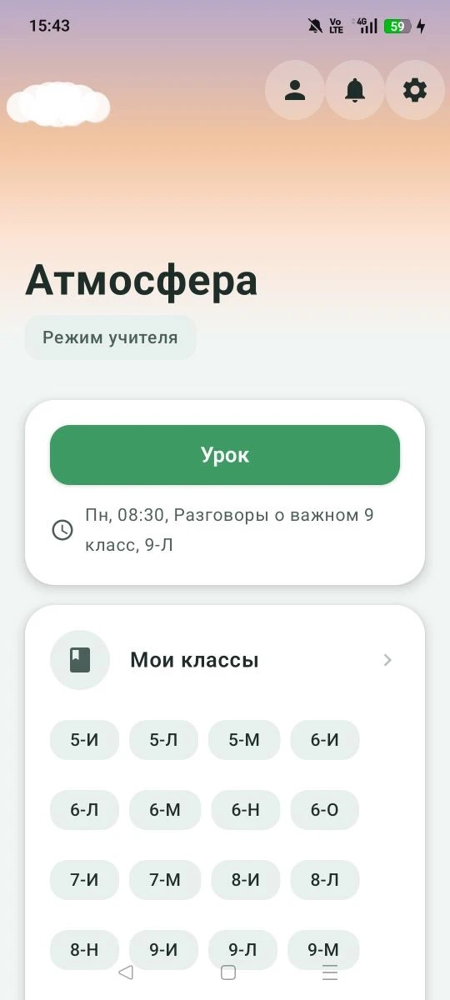
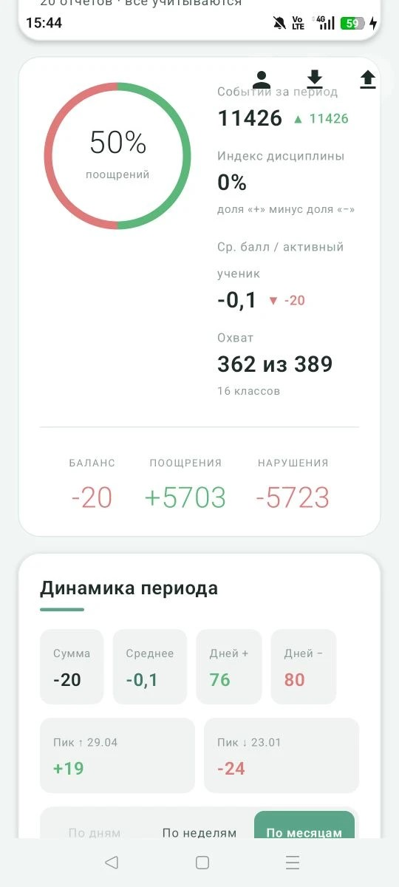
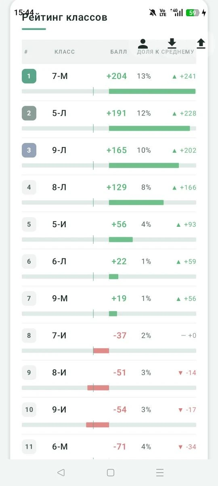
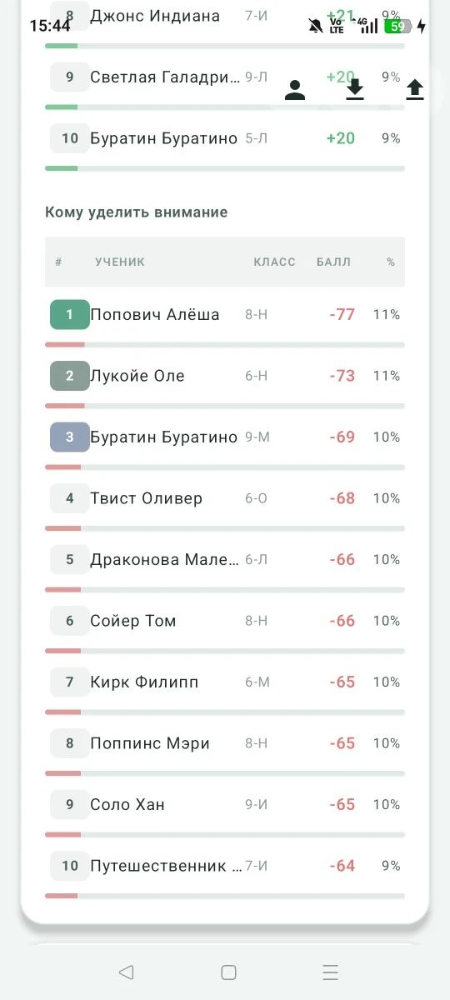
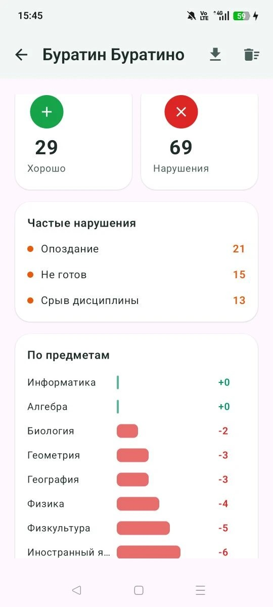
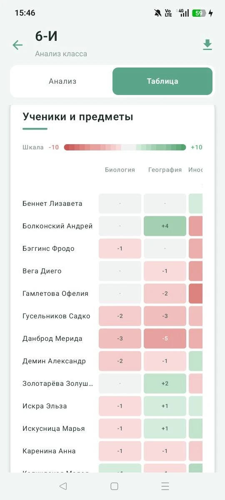
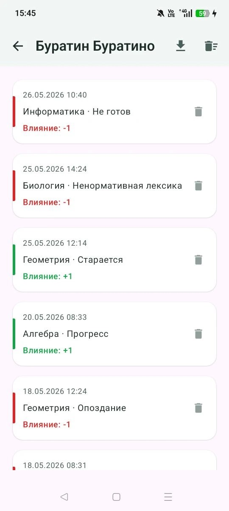

# Атмосфера

Школьное приложение для Android. Записывает на уроке, кто молодец, а кому нужно замечание — без бумажного журнала и без лишних экранов. Завуч получает сводку по классам, когда учителя присылают отчёты.

Работает офлайн. Данные хранятся на телефоне, облака у приложения нет.

  
  
  
  
   
  
  
  

---

**Учитель.** Добавляете классы, учеников и расписание — вручную или из файла. На уроке открываете класс: на экране ученики, короткое нажатие — отметка, долгое — карточка с историей. Видно баланс за сегодня. Раз в неделю или месяц формируете отчёт и отправляете завучу через мессенджер или почту.

**Завуч.** Загружаете файлы от учителей в приложение. Смотрите период: динамика, сравнение классов, кому похвалить, с кем поговорить, тезисы для педсовета. Есть поиск по ученику и отдельный разбор каждого класса. Свои отметки и чужие отчёты можно включать в сводку или убирать — данные при этом не удаляются.

**Связка.** Учитель выгружает файл из настроек. Завуч импортирует его у себя.

**Данные.** ФИО учеников и отметки не уходят разработчику. Удалить всё можно в настройках. [Политика конфиденциальности](https://github.com/mrKamanov/atmosphere/blob/main/docs/PRIVACY_POLICY.md)

---

Android 8+. Исходники: [GPL v3](LICENSE). Коммерческая лицензия — [отдельно](COMMERCIAL_LICENSE.md).

Сергей Каманов
